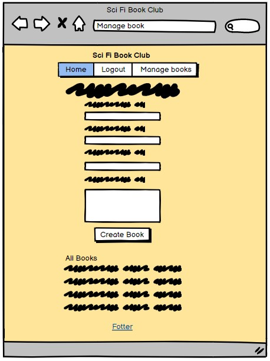
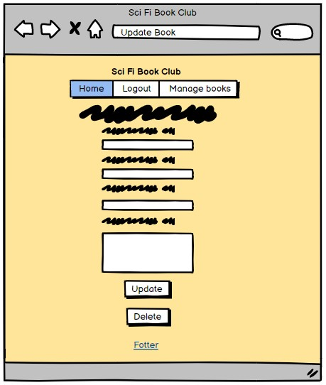
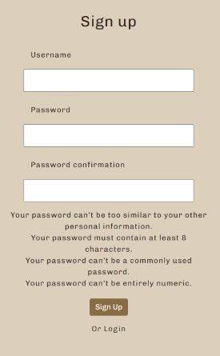
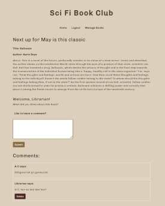

# Sci fi Book Club
#### [View the live project here](https://scifi-book-club.herokuapp.com)
Welcome to my Sci Fi Book Club website! The primary goal is to create a vibrant online community where sci fi book enthusiasts can come together to read and discuss their favorite literary works.

Upon visiting our home page, users are greeted with a captivating display of our current "Book of the Month,"  Additionally, they can easily explore our extensive archive of previous books, providing a wealth of inspiration for their next reading adventure.

## UX User experience
### Project Goals

To build a website for a book club where members can read and discuss books together. The homepage features the current "Book of the Month" and previous book selections. Users can find book recommendations and engage in discussions with fellow members. Librarians can manage the book collection with CRUD functions, and users can leave comments on books. Create a dynamic and inspiring platform for book lovers to connect and explore literature.

Thees are two different user permissions.
Regular users, anyone who wants can register an account to be able to leave comments on books and interact with other users.
And then there are Librarians, they have access to the management part and can create, update and delete books. Admin appoints Librarians with Django's Admin panel

### Strategy
To ensure an efficient  development process, an Agile methodology was adopted for this project. Specifically, a Kanban approach was implemented using the GitHub Project feature, which allowed for better organization and tracking of tasks.

### Planning
GitHub Project and Issues were used for Agile project planning. User Stories with acceptance criteria were defined in GitHub Issues, and development progress was managed on a Kanban board.

### Epic
As a book club member, I want to engage in meaningful discussions about books and connect with fellow readers to enhance my reading experience.

### User stories:
-   **View books list:** As a Site User I can view a list of books so that I can select one to read about
-   **View book:** As a Site User I can click on a book so that I can read the full text about it
-   **Account registration:** As a Site User I can register an account so that I can comment and reed other members comments.
 -   **Account log in:** As a registed Site User I can log in to my account so that I can comment and reed other members comments.
 -   **Account log out:** As a logged in Site User I can log out to prevent other people to acsess my acount.
-   **View comments:** As a logged in Site User I can view comments on an individual book so that I can read the comments about it.
-  **Comment on a post:** As a logged in Site User I can leave comments on a book so that I can be involved in the conversation
-   **Delete a Comment:** As a logged in Site User I can delete a comment I wrote on a book so that I can change my minde
-   **Manage book:** As a Site Admin/ Librarian I can create, read, update and delete books so that  I can manage the book clubs content
-   **Delete a book:** As a logged in Site User I can delete a comment I wrote on a book so that I can change my minde
-  **Change credentials:** As a admin I can, from the admin panel, update a users credentials to Librarian/superuser.

## Design
Creating a calm atmosphere that brings to mind space, the desert and places as far away as our imagination can stretch has been a basis in the design work. The colors and layout are chosen to be reminiscent of sand craters in a desolate landscape.

To make it easier for the user, all links have an on hoover in a golden color. External links open in another window and the menu bar adapts to the user and the information that makes sense to see.

The colors used are:

### Wireframes
Wireframes were created using Balsamiq during the planning phase to visualize the website's layout on desktop and mobile devices.

## Features

###  Home page
On the home page, all users can find the book of the month at the top and earlier books underneath. The page is responsive and display the page different depending on screen size.
The text color of the books will change color to gold when  cursor focus.
## 

### Navigation bar
The top navigation is display differently depending on user validation status. For a not logged in user I contain Home and Login. When logged in it changes to log out. For a logged in Liberian there is also a link to Manage Book.
The links in the Top Nav will, as al other links and buttons, change color to gold when cursor focus.
## 

### Messages
Throughout, the user will receive messages about various actions such as, you have logged in, comment deleted and book created successfully.
## 

### Log in
The log in page contain a form with username and password. It will validate that the information provided is correct. A correct login redirect the user to home page and provides a message of success login.
Just under the login button, there is also a link to Sign Up if not already.
Both the link and button, change color to gold when  cursor focus.
## 

### Sign up
The sign-up page contains a form with username, password and a confirmation password field. There is also information about what a valid password is. They form will validate that's all information is filled in correctly.
The button will change color to gold when  cursor focus.
## 

###  Display single book
Om this page, all users can reed more about the book.
A logged-in user can view comments and write a comment. A logged-in user can also delete comments written by them self. The different colored buttons will change color to gold when  cursor focus.
## 

###  Manage book page /Library
On the Library page, a Liberian /superuser can create a new book by filling in the form. There is also a list of all books and by clicking a book a Liberian can edit or delete it. Before deleting, the page will ask if the user is sure. All Liberians can handle all books. The books in the list of books and different colored buttons will change color to gold when  cursor focus.
## 

###  Fotter
The footer tells the user that for contact and to discuss upcoming books, there is a Facebook page. The link opens in a new page, and for now it's Facebook homepage. The link text about Facebook will change color to gold when  cursor focus.
## 

###  Favicon
Favicon icon on the tab in the browser. Makes it easier for the user to find the page if there are many open tabs.
## 

###  Admin panel
In Django admin panel, admin can give special user / librarian status of superuser. A librarian can create, edit and delete books. A librarian cannot log in to the Admin panel.
Superuser status = Designates that this user has all permissions without explicitly assigning them.
## 

###  Features to implement later
Add hero image and the possibility to load up an image of the book when creating a new book.

## Data Model

This project includes two custom models, Post and Comment.
## 

## Site map
Site map created in Jam bord.
## 

## Technologies
- HTML
- CSS
- JavaScript
- Python

Frameworks, Libraries and Programs Used:
- Django/allauth - Python framework
- Django
- Bootstrap
- GitHub
- GitHub Pages
- Gitpod
- Heroku
- Cloudinary
- Google Fonts

## Testing

-   HTML  **W3C tools**
## 

-   CSS  **W3C tools**
## 

-   Lighthouse In DevTools
## 

-   JSHint

base.html, update_book.html, book_detail,html
## 

-  CI Python Linter

forms.py, models.py, views.py
## 

### Browser Compatibility

The following browsers have been tested:

-   Chrome Version 108.0.5359.125
-   Mozilla Firefox Version 108.0.1
-   Edge Version 108.0.1462.54
-   Safari on macOS Version 16.1

Tested on hardware:

-   Asus laptop 17 inch
-   MacBook Pro 16 inch
-   MacBook Pro 15 inch
-   Desktop: 2560 wide monitor to MacBook

### Mobile responsiveness testing.

Chrome Developer tools were used for more extensive testing.

Following mobiles has been tested:

-   iPhone 5 / SE
-   iPhone 7
-   iPhone Pro Max
-   Samsung Galaxy a52s
-   Huawei P20 pro
-   Sony Xperia 5 III

### Manual testing
|Command input              |Expected response                     |Results |
|----------------|-------------------------------|-----------------------------|
|**Home page**                |Please choose c or p:         |Pass |
|- Clicking Sci Fi Book Club logo |Open Home page.         |Pass |
|- Cursor focus: all the links and button  |Text turning gold. |Pass |
|- Clicking Facebook link                  |Opens Facebook in a new tab   |Pass |
|- Open page in large window           |Books are viewed tre in a row |Pass |
|- Open page in Mobile   |Books are viewed on top of each other |Pass |
|**If Logged In In**
|- Clicking Log out link in top menu or at the bottom  |Message: You are logged out, redirect to Home        |Pass |
|- Clicking any of the Books                    |Redirect to that books page: |Pass |
|- Clicking Logout      |User is logged out and logout link changes to Log In |Pass |
|**If Logged In as a Librarian/Superuser**
|- Link: Manage Books is viewed     | Click it: Opens page: - Manage Books /Library site  |Pass |
||||
|**Log in page:**	      |  | |
|- Clicking Sci Fi Book Club logo    | Open Home page.        |Pass |
|- Cursor focus: all the links and button  |Text turning gold. |Pass |
|- Click log in button with empty form   |Message: Invalid login Credentials. |Pass |
|- Click log in button with invalid username  |Message: Invalid login Credentials. |Pass |
|- Click log in button with invalid Password |Message: Invalid login Credentials. |Pass |
|- Clicking Or sign up                      |Open Sign up page.         |Pass |
|- Clicking Facebook link                  |Opens Facebook in a new tab            |Pass |
|- Logging in                 |Redirect to Home and Message: You are logged in          |Pass |
||||
|**Sign up page:**	      |  | |
|- Clicking Sci Fi Book Club logo                |Open Home page.       |Pass |
|- Clicking Log In link in top menu or at the bottom     |Open Log In page.        |Pass |
|- Cursor focus: all the links and button  |Text turning gold. |Pass |
|- Click Sign Up button with empty form   |Message: Fill in empty field. |Pass |
|- Trying to sign up with different pas worlds |Re lodes the form to try again. |Pass |
|- Clicking Facebook link                  |Opens Facebook in a new tab            |Pass |
| |||
|**Book detail page** |  
|- Clicking Sci Fi Book Club logo                |Open Home page.       |Pass |
|- Clicking Log In link in top menu   |Open Log In page.        |Pass |
|-Cursor focus: all the links and button    |Text turning gold. |Pass |
|- Content under Book description |Please log in to leave a comment. |Pass |
|**If Logged In**
|- Clicking Log out link in top menu or at the bottom  |Message: You are logged out, redirect to Home        |Pass |
|-  Content under Book description   |Welcome, Username! Like to leave a comment?       | Pass |
|- Clicking submit with empty form  |Reloads the form     |Pass |
|-  Submit the form   |Posts the comment at the top of the comments   |Pass |
|-  Clicking the Delete button   |Message: Are you sure you want to delete?   |Pass |
|-  Clicking Yes to: Are you sure you want to delete?   |Deletes the comment   |Pass |
| |||
|**Manage Books Page** | | |
|**Only visible as Logged In as a Librarian/Superuser ** |               |Pass |
|-Clicking Sci Fi Book Club logo |Open Home page. |Pass |
|- Clicking Log out link in top menu or at the bottom    |Message: You are logged out, redirect to Home   |Pass |
|- Cursor focus: all the links and button                      |Text turning gold.                |Pass |
|- Clicking Facebook link                               |Opens Facebook in a new tab               |Pass |
|- Click Create Book button with any empty form                |Message: Fill in empty field.      |Pass |
|- Clicking any of the book links under All Books            |Redirect to that page       |Pass |
| |||
|**## Update Book Page**| | |
|**Only visible as Logged In as a Librarian/Superuser ** | |Pass |
|- Form appears filled in with previously field in information ||Pass|
|- Clicking the Update button                   |Lodes: Manage books page             |Pass|
|- Clicking the Delete button                |Message: Are you sure you want to delete?          |Pass|
|-  Clicking Yes to: Are you sure you want to delete?   |Deletes the comment. Loads the Home Page |Pass |
|           |     | |
|**/admin/ Django Login panel:**|          | |
|- Trying to log in to the Django admin panel as a user |Not allowed access: Please enter the correct username and password for a staff account.        |Pass |
|- Trying to log in to the Django admin panel as a Librarian/ Superuser |Not allowed access: Please enter the correct username and password for a staff account.   |Pass |
|           |     | |

## Deployment
 **How you set up GitHub** 

Create a [fork of the repository.](https://docs.github.com/en/get-started/quickstart/fork-a-repo#forking-a-repository)

1. Log in to GitHub and go to repository: [LinnSilver/make-a-quiz-pj3](https://github.com/LinnSilver/make-a-quiz-pj3)
2. Click button fork -Create a new fork.
3. Choose repository name.
4. Click Create fork.

Now you have a fork of the repository in your repository. To access code:
 
5. In your new repository:
6. Click green button: Code arrow down.
7. Choose: Create codespace on main - Code is opened in a web codespace.

After this, you do not have the files in the repository locally on your computer.
To save a copy locally on your computer:
 
9. On GitHub.com, navigate to your fork of the repository.
10. Above the list of files, click Code, Local.
11. Copy the URL for the repository.
12. Open Git Bash.
13. Change the current working directory to the location where you want the cloned directory.
14. Type  `git clone`, and then paste the URL you copied earlier.
15. Press Enter. Your local clone will be created.

It's important to commit and push correctly. Read more here:
- [How to Commit and push code from local file system to GitHub Pages.](https://docs.github.com/en/desktop/contributing-and-collaborating-using-github-desktop/making-changes-in-a-branch/committing-and-reviewing-changes-to-your-project)

After every change in the code, it's important to redo the test section. Go through:
- Python Linter
- Manual testing

 **How to set up Heroku** 
1.   Log in on Heroku.
2.  Click: Show next steps.
3.  Click: Create new app.
4.  Fill in App name and choose a region. Click: Create app.

6. Under **Settings,** choose Deployment method GitHub.
7. Click: Add Buildpack
8. Choose heroku/python. Click: Save
9. Click: Add Buildpack
10. Choose heroku/nodejs. Click: Save

11.  Under **Deploy,** choose Deployment method GitHub.
12.  **Search for a repository to connect to,**  choose repo name LinnSilver/make-a-quiz-pj3.
13.  Click: Deploy Branch.

## Credits
### Content
All content on this command-line application was written by the developer.

### Acknowledgments
Thank you to my mentor Brian Macharia. Your expertise and support have been instrumental in making this project. I truly appreciate your dedication and willingness to share your knowledge.